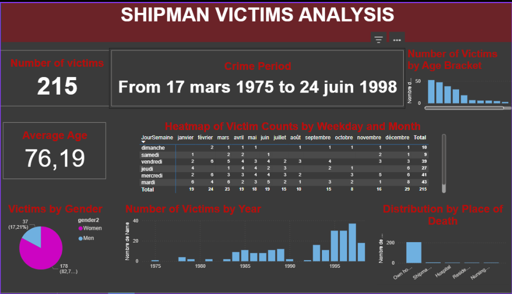

# 🩺 Dr Death - Power BI Analysis of Serial Killer Harold Shipman


🎯 Project Objective
This project aims to explore data related to the murders committed by Harold Shipman, considered the most prolific serial killer in the United Kingdom. Through the creation of an interactive dashboard in Power BI, we seek to answer the central question:

What types of people did Harold Shipman kill, and when did they die?

This work combines data analysis and interactive visualization to better understand trends, victim profiles, and temporal anomalies in his crimes.

## 📁 Repository Structure

```
dr-death/
├── README.md                  # Full project presentation
├── datasets/                  # Raw data used
│   ├── shipman-confirmed-victims.csv
│   └── shipman-times-comparison.csv
├── rapport/                   # Power BI dashboard screenshots
│   ├── visualisation_1.png
│   ├── visualisation_2.png
│   └── ...
└── dr-death-dashboard.pbix    # Main Power BI file
```

## Summary

1. TECHNOLOGICAL MONITORING ON Power BI
2. SHIPMAN ANALYSIS

   1. DATA LOADING
   2. DATA CLEANING AND TRANSFORMATION WITH POWER QUERY
   3. VISUALIZATIONS

      * VICTIM PROFILE
      * TEMPORAL ANALYSIS
      * ANALYSIS OF PLACES OF DEATH
      * CORRELATION STUDY
      * COMPARISONS SHIPMAN VS OTHER DOCTORS
   4. CONCLUSION

## 1. TECHNOLOGICAL MONITORING ON Power BI

**Power BI** is a Business Intelligence solution developed by Microsoft, designed to transform raw data into interactive and decision-making visualizations. It allows centralizing, cleaning, analyzing, and presenting data from heterogeneous sources.

🔧 **Main Features**

* **Multiple data import** (Excel, CSV, databases, API…)
* **Power Query** for data cleaning and transformation
* **DAX (Data Analysis Expressions)** to create custom measures and indicators
* **Interactive canvas** to build dynamic reports with filters, segments, and drill-down

✅ **Advantages**

* **Easily connect and transform multiple data sources** without affecting the original databases
* **Dynamic and interactive visualizations**, accessible even to non-technical users
* **Seamless integration with Microsoft ecosystem** (Excel, Teams, SharePoint, Azure…)
* **Ability to combine different data types** (structured and semi-structured) in the same analysis
* Intuitive drag-and-drop interface
* Strong performance even on large datasets

❌ **Disadvantages**

* Learning curve for advanced functions (notably DAX and M)
* Limitations in the free version for sharing and collaboration
* Less suited for complex predictive models compared to tools like Python or R

**Usage context here** In this study, Power BI is used to analyze sensitive and complex data related to a series of crimes. The goal is to **make the data speak** to better understand Harold Shipman's criminal patterns: victim profiles, time anomalies, places of death, regional comparisons.

## 2. SHIPMAN ANALYSIS

### 📚 Case Context

Harold Shipman, nicknamed **"Dr Death"**, is considered the **most prolific serial killer in UK history**. A respected general practitioner in Hyde, Greater Manchester, he murdered at least **215 patients between 1975 and 1998**, mainly elderly women, by administering lethal doses of morphine.

His behavior began to raise suspicions when he falsified a patient's will, triggering a wider investigation. This revealed **fraudulent changes in medical records**, time anomalies in deaths, and repetitive patterns in victim profiles. The case shook the British medical system, exposing the dangers of **institutionalized abuse of trust**.

This project aims to **analyze these elements visually and interactively** using Power BI to identify the **underlying patterns of his murders**.

### 2.1 DATA LOADING

Two main files were used to conduct the analysis:

📁 `shipman-confirmed-victims.csv`
This file contains data on **officially identified victims** of Harold Shipman between 1975 and 1998.

* **Key columns**: `Name`, `Date_of_death`, `Age`, `Gender`, `Place_of_death`, `Postal_code`
* **Objective**: Build a **statistical profile of the victims**, visualize the **timeline of deaths**, and identify **geographic patterns**.

📁 `shipman-times-comparison.csv`
This file compares the hourly distribution of deaths among Shipman's patients with those of other general practitioners in Greater Manchester.

* **Key columns**: `Hour`, `Shipman_deaths`, `Other_GPs_deaths`
* **Objective**: Highlight a **time-based anomaly**, showing that Shipman killed his patients at specific hours, unlike the norm.

### 2.2 DATA CLEANING AND TRANSFORMATION WITH POWER QUERY

The `shipman-confirmed-victims.csv` file contains information on each confirmed victim of Harold Shipman, including the date and place of death, age, gender, and derived elements for analysis. After verification, the columns are properly formatted.

Transformations were applied to enrich the analysis:

* **Derived columns**: extraction of **day of the week** (`JourSemaine`) and **month** (`Mois`) from the date of death (`DateofDeath`), with numeric equivalents (`JourSemaineNum`, `MoisNum`) for sorting.
* **Categorical columns**: creation of **age brackets** (`ageBracket`) and textual display of **gender** (`gender2`).
* **Fine temporal columns**: addition of `fractionalDeathYear` for chronological decimal reading.
* **Calculated measures** in Power BI:

  * `DateMin` and `DateMax` to delimit Shipman's period of activity.
  * `PeriodeActivite`: dynamic display of this period in dashboards.

This cleaning enabled a solid structure for temporal, demographic, and geographic analyses.

### 2.3 VISUALIZATIONS

Several DAX measures were created to summarize and explore the data:

* **Total number of victims**
* **Average age at death**
* **Period of activity** between the first (`DateMin`) and last (`DateMax`) victim.

Main visualizations produced:

1. **Overview**:

   * Number of victims, average age, activity period (first to last death).

2. **Temporal analysis**:

   * Heatmap crossing day of week and month of death.
   * Comparison of hourly death frequency between Shipman and other doctors (column charts).

3. **Demographic analysis**:

   * Distribution of victims by **gender**, **age bracket**, and **place of death**.

4. **Mapping**:

   * Map of deaths by location type: home, hospital, nursing home, etc.

#### Key observations:

* **Critical time slots**: Deaths mostly occurred in the morning, a unique pattern of Shipman's profile.
* **Targeted victims**: Mainly elderly women living alone at home.
* **Intense period**: High concentration of deaths between 1993 and 1998.
* **Dominant days & months**: Tuesdays and Thursdays show mortality peaks, especially from January to March.

## 2.4 CONCLUSION

✅ **1. Opportunistic and methodical targeting**
The cross-analysis of the **victim gender and age chart** with British demographic and legal data reveals a **precise predatory pattern**: Harold Shipman primarily targeted **elderly women**, widows or close to becoming so. This is due to several factors:

* In England, **70% of women outlive their spouse**, making them often alone and vulnerable.
* Their **longer life expectancy (85 vs. 79 years for men)** exposes them to extended medical care.
* Under English law, **inheritance goes to the surviving spouse**, which may motivate will falsification. Shipman thus exploited a population that was isolated, unlikely to complain, and often without direct witnesses, maximizing his chances to act undetected.

✅ **2. An M.O. aligned with a "regular" professional schedule**
The chart on the **weekly distribution of murders** shows a sharp concentration of deaths from **Monday to Friday** (over 90% of cases), with a **drastic drop on weekends** (barely 8.8% on Saturday and Sunday combined).

This pattern suggests a clear organizational logic:

* **Shipman acted like an "office-hours professional"**, planning murders during his official work time, aligned with consultations.
* **Weekends were "off"**, probably to preserve his family image or avoid logistical complications (fewer scheduled medical interventions, more relatives present at patient homes, etc.).

This **quasi-bureaucratic distribution of homicides** is disturbing: it shows that Shipman **integrated murder into his medical routine**, as a "technical" act, inserted into a classic workday. This cold, methodical behavior reinforces the **predatory, dehumanized, and perfectly concealed** nature of his actions.

✅ **3. Time-based predation targeting moments of maximum vulnerability**
The analysis of the **hourly death distribution** reveals a striking peak between 2 PM and 5 PM, with a maximum around 3 PM, in sharp contrast to the balanced distribution of natural deaths. This temporal concentration is explained by several strategic factors:

* **Shipman aligned murders with his afternoon home visits**, after morning office consultations, creating a predictable and safe window of action.
* This time slot offered **optimal isolation of victims**, often elderly women alone at home at that precise time.
* The afternoon was an **ideal time to administer lethal diamorphine**, sign death certificates, and falsify medical records without witnesses.
* This temporal pattern allowed him to **intercalate murders among legitimate visits**, normalizing these events in his professional routine.

This statistical signature, later identified by Professor David Spiegelhalter, demonstrates how Shipman methodically integrated his crimes into an outwardly irreproachable medical practice. The time of deaths thus becomes a revealing "behavioral marker," which experts say could have enabled his detection as early as 1996, potentially preventing dozens of additional victims.

✅ **4. A revealing fluctuation: the impact of complaints and opening an independent practice**
The analysis of the **annual murder distribution chart** reveals a significant anomaly: a **clear slowdown in criminal activity between 1990 and 1992**. This period coincides precisely with two major events:

* **Formal complaints** lodged by patients with the Donneybrook local health authority in 1990 and 1992, suggesting a period of increased scrutiny.
* Preparation then opening of his independent practice at 21 Market Street in Hyde on January 1, 1992, after working at the Donneybrook Medical Centre.

This **temporary decrease in criminal activity** can be explained by several strategic factors:

* Shipman likely adopted an **extremely cautious posture** following complaints, aware he might be under observation.
* The professional transition period required an **impeccable image** to attract new patients to his private practice.
* Setting up a new practice required **considerable logistical and administrative investment**, reducing his criminal opportunities.

The chart then shows a **gradual resumption** from 1992–1993, dramatically accelerating after 1995 to reach a horrifying peak of nearly 40 victims in 1997. This escalation suggests that once firmly established in his private office and feeling secure again, Shipman not only resumed his murderous activities but intensified them alarmingly, buoyed by renewed confidence and full professional autonomy.

This statistical fluctuation perfectly illustrates the **calculating and adaptive nature** of Shipman, capable of temporarily adjusting his criminal behavior based on perceived risks while maintaining his murderous determination in the long term.
